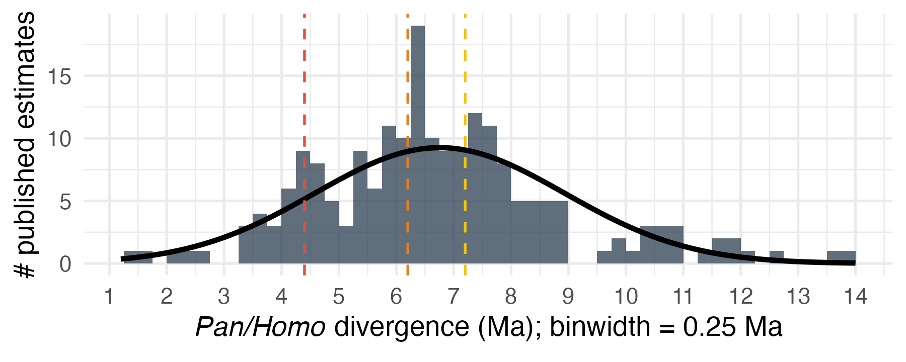
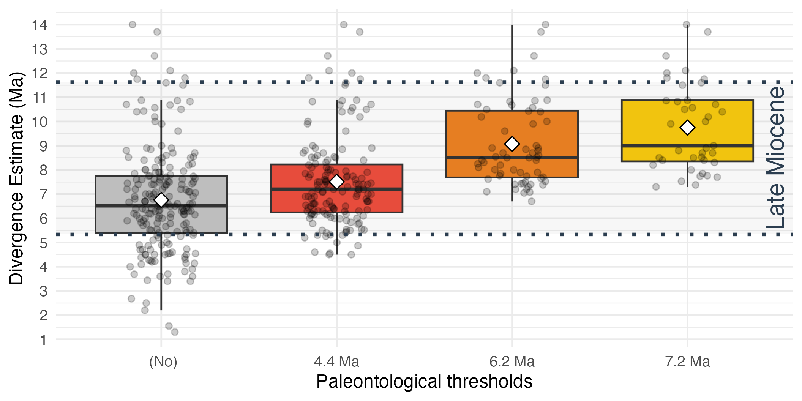
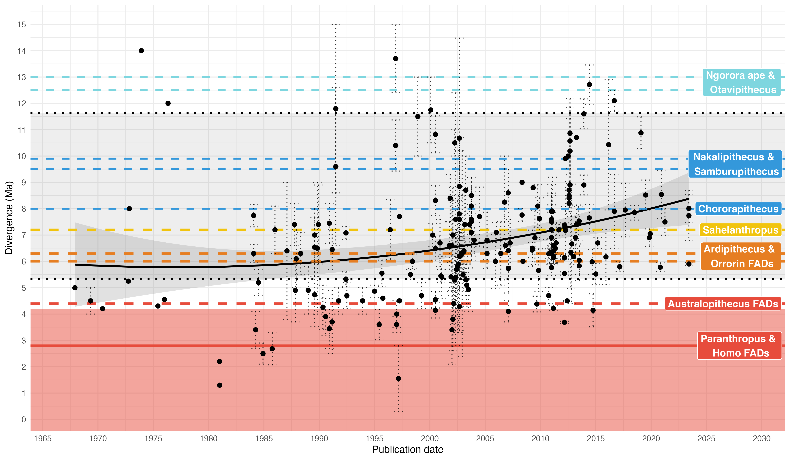
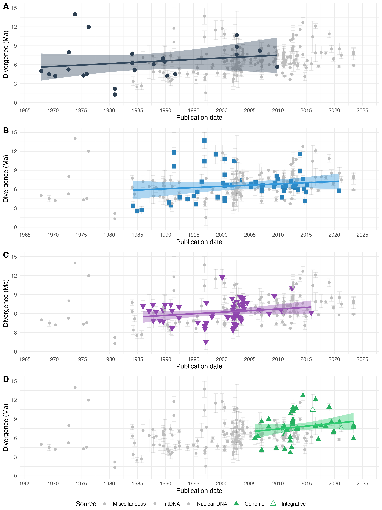
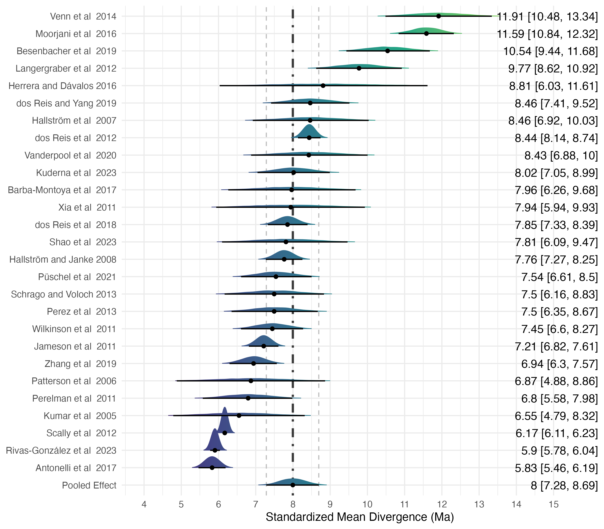
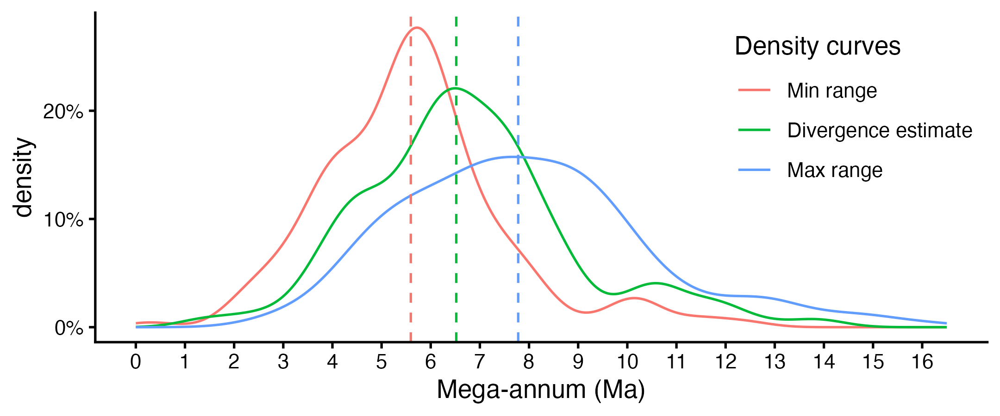

# *Pan*-*Homo*
**Paleontological and Molecular Divergence of the last common ancestor between hominins and panins**

This repository provides a reproducible pipeline for the meta-analysis of molecular divergence estimates between humans and chimpanzees, evaluated against the late Miocene and early Pliocene fossil record.

---

## 📂 Project Structure

- `data/`
Contains `HomoPanDivergences.csv`, the primary dataset of sampled molecular estimates.

- `R/`
The core logic. Includes data preparation (`prepare_data.R`), utility functions (`functions_utility.R`), and the Bayesian Meta-Analysis engine (`analysis_meta.R`).

- `models/`
Stores the `.rds` files for the 5 Bayesian models (Full, A, B, C, and Genomic).

- `figures/`
Scripts and outputs for the Main Manuscript figures.
Output images are located in: `figures/output/`
(`Figure_1.png` to `Figure_5.png`)

- `supplementary/`
Scripts and outputs for the Supporting Information (SI) figures and tables.

---

## 🚀 How to Reproduce the Analysis

Run the scripts in the following order to ensure all models are calculated before plotting:

### 1. Initialize and Run Models

```r
source("R/prepare_data.R")
source("R/analysis_meta.R")
```

### 2. Generate Main Figures

```r
source("figures/make_main_figures.R")
```

### 3. Generate SI Figures and Tables

```r
source("supplementary/make_si_figures.R")
source("supplementary/make_si_tables.R")
```

---

## 📊 Manuscript Figures & Legends

### Main Figures

#### Figure 1 – Molecular estimates histogram


Dashed vertical lines represent the fossil thresholds. Note that instead of following a normal distribution, studies seem to cluster in excess around important fossil discoveries.

---

#### Figure 2 – Interquartile range boxplots


Divergence estimates filtered by different fossil thresholds. All boxplots fit within the late Miocene (11.6–5.3 Ma).

---

#### Figure 3 – Full-dataset model trend


Fitting the sample of *Panini/Hominini* split estimates by date of publication.

---

#### Figure 4 – Linear regressions by source


Linear regressions for different types of source datasets. 
A) Includes early phenetic studies (immunological, DNA-DNA hybridization, etc.), but also later studies with virogenes and RNA; 
B) Mitochondrial datasets from early studies with selected sequences to later complete mitochondrial genome studies; 
C) Split estimates based on nuclear DNA sequences; and 
D) Large phylogenomic studies (also includes ‘total evidence dating’, i.e., integrative models).

---

#### Figure 5 – Meta-analysis of phylogenomic estimates


Forest plot depicting the specific effect size and sampled posterior distribution of genome-based studies.

---

## 📎 Supplementary Figures

- **Fig. S1 – Density curves**
  
  Min–estimate–max triplets sampled from the literature. Dashed vertical bars represent median values.

- **Figs. S2–S5 – Sensitivity BMAs**
  Full dataset and subsets filtered by 4.4 Ma, 6.2 Ma, and 7.2 Ma thresholds.

---

## 🛠 Requirements

R environment with the following packages:

- `brms`
- `Stan`
- `tidybayes`
- `ggdist`
- `ggplot2`
- `ggridges`
- `psych`
- `dplyr`

---

## 📬 Contact

**João d'Oliveira Coelho**
joaocoelho@gorongosa.net

---
