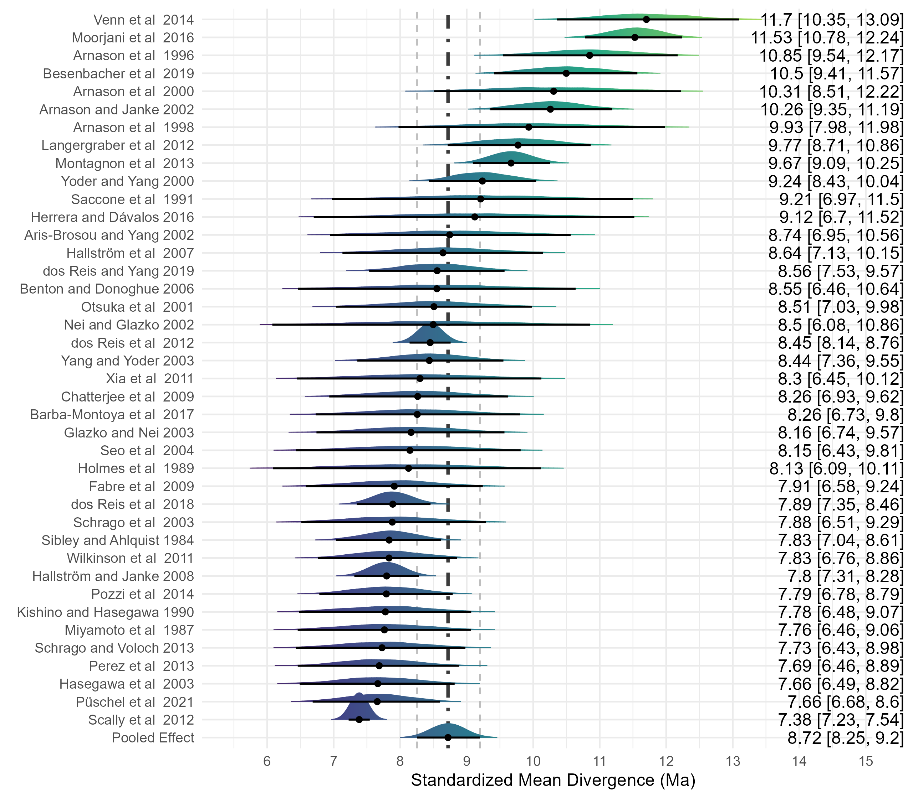

# PanHomoptic

A paleontological overview of the molecular literature for the *Pan*/*Homo* split.

~

The following files generate all figures available on the main text:

+ `GENERATE_Figure_1_and_2.R`
+ `GENERATE_Figure_3_and_4.R`
+ `GENERATE_Figure_5__RUN_MetaAnalysis.R`

The figures availabe in our article's supplementary information can be generated by running the following code:

+ `SI_Fig1.R`
+ `SI_Fig2_Fig3_all_subsets_BMA.R`

Moreover, the file `SI_Fig2_Fig3_all_subsets_BMA.R` runs 4 meta-analyses:

1. Without any data filtered
2. Dataset filtered by the 4.4 Ma threshold
3. Dataset filtered by the 6.2 Ma threshold
4. Dataset filtered by the 7.3 Ma threshold

The last analysis in present in the main text, and can be redundantly performed also with `GENERATE_Figure_5__RUN_MetaAnalysis.R`.

~

**Figure 1.** Histogram of all molecular estimates showing the three fossil thresholds as dashed vertical lines. Note that instead of following a normal distribution, there is an unexpected gap at 9–9.5 Ma, and studies seem to cluster in excess around important fossil discoveries.

**Figure 2.** Interquartile range boxplots for divergence estimates filtered by different fossil thresholds. The arithmetic means and the medians are represented by white diamonds and black bars, respectively. All boxplots fit within the late Miocene (11.6–5.3 Ma).

![Figure 3. Polynomial regression “full-dataset model” fitting the sample of Panini/Hominini split estimates by date of publication. Vertical dashed bars represent dates of publications of possible early hominins. A) Au. anamensis, Ar. ramidus; B) O. tugenensis, Ar. kadabba; C) S. tchadensis. The “Sahelanthropus-restricted model” linear regression in purple fits all data above the Sahelanthropus filter (7.2 Ma) and since its publication (2002). The late Miocene is within the horizontal dotted black bars.](Figures/Figure_3.png)
**Figure 3.** Polynomial regression “full-dataset model” fitting the sample of Panini/Hominini split estimates by date of publication. Vertical dashed bars represent dates of publications of possible early hominins. A) *Au. anamensis*, *Ar. ramidus*; B) *O. tugenensis*, *Ar. kadabba*; C) *S. tchadensis*. The “*Sahelanthropus*-restricted model” linear regression in purple fits all data above the Sahelanthropus filter (7.2 Ma) and since its publication (2002). The late Miocene is within the horizontal dotted black bars.

**Figure 4.** Polynomial regression with molecular estimates, excluding the first two decades and the studies in the shaded areas in red, orange and yellow (filtered-by-thresholds model). The linear regression in green (genomics-specific model) includes only the studies based on genomic data (without filtering).

**Figure 5.** Forest plot depicting the specific effect size and sampled posterior distribution of each study after applying the 7.3 Ma threshold.

**Extended Data Fig. S1.** Density curves for the min-estimate-max triplets sampled from the literature. Dashed vertical bars represent median values for each density curve. 

**S1. Dataset distribution**
Is the database generally biased toward values that are too recent in geological time to be possible? We would expect that the density curves of estimations (Extended Data Fig. S1) would approximate a normal distribution and, that their left tail should start close to the levels of the fossil thresholds (4.4 to 7.3 Ma). Moreover, they should center at some larger value and then mirror to some extent this pattern at the right tail i.e., normality. Instead, we obtained displaced (starting at ~1.3 Ma) and right-skewed density curves, especially for the Min range values. Overall, these statistical artefacts are strong evidence of a bias towards underestimation of time passed since the *Pan*/*Homo* divergence. As expected, the Max estimations are platykurtic—revealing uncertainty—since deriving a maximum bound from the fossil record is more problematic as it must rely on negative evidence.
